# Mermaid Trace Calculator - Edge Cases Documentation

This document comprehensively covers all possible edge cases for the `MermaidTraceCalculator` when calculating execution traces from Mermaid flowchart syntax.

## Table of Contents

1. [Mermaid Parsing Edge Cases](#mermaid-parsing-edge-cases)
2. [Graph Structure Edge Cases](#graph-structure-edge-cases)
3. [Node Type Edge Cases](#node-type-edge-cases)
4. [Loop and Cycle Edge Cases](#loop-and-cycle-edge-cases)
5. [Parallel Gateway Edge Cases](#parallel-gateway-edge-cases)
6. [Exclusive Gateway Edge Cases](#exclusive-gateway-edge-cases)
7. [Path Finding Edge Cases](#path-finding-edge-cases)
8. [Visit Count and Loop Detection Edge Cases](#visit-count-and-loop-detection-edge-cases)
9. [Node Identification Edge Cases](#node-identification-edge-cases)
10. [Edge Label Parsing Edge Cases](#edge-label-parsing-edge-cases)
11. [Trace Combination Edge Cases](#trace-combination-edge-cases)
12. [Duplicate Trace Filtering Edge Cases](#duplicate-trace-filtering-edge-cases)

---

## Mermaid Parsing Edge Cases

### 1.1 Invalid Mermaid Syntax
**Description:** Mermaid syntax with parsing errors or invalid structure.

**Edge Cases:**
- Missing arrow in edge: `node1 node2`
- Invalid node syntax: `node1:invalid:type`
- Malformed edge labels: `node1 -->|unclosed node2`
- Empty lines and whitespace
- Comments in syntax (not standard Mermaid)

**Expected Behavior:**
- Should skip invalid lines with warning
- Continue parsing valid parts
- Return graph with valid nodes/edges only
- Log warnings for skipped elements

**Test Case:**
```mermaid
graph LR
node1 --> node2
invalid syntax here
node2 --> node3
```

### 1.2 Missing Graph Declaration
**Description:** Mermaid syntax without `graph` or `flowchart` declaration.

**Edge Cases:**
- Direct edge definitions without declaration
- Only node definitions
- Empty string

**Expected Behavior:**
- Should handle gracefully
- Try to parse nodes/edges anyway
- May result in empty or partial graph

**Test Case:**
```
node1:task:(Task 1) --> node2:task:(Task 2)
```

### 1.3 Graph Direction Variants
**Description:** Different graph direction declarations.

**Edge Cases:**
- `graph LR` (Left to Right)
- `graph TD` (Top Down)
- `graph TB` (Top Bottom, same as TD)
- `graph RL` (Right to Left)
- `graph BT` (Bottom Top)
- `flowchart LR` (newer syntax)
- Case variations: `GRAPH`, `Graph`, `graph`

**Expected Behavior:**
- Should ignore direction (not used in trace calculation)
- All directions treated the same
- Filter out declaration line: `!line.match(/^(graph|flowchart)\s+(LR|TD|TB|RL|BT)/i)`

**Test Case:**
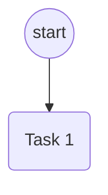

### 1.4 Continuation Lines
**Description:** Edge definitions split across multiple lines.

**Edge Cases:**
- Node definition on one line, arrow on next: `node1:task:(Task 1)\n--> node2:task:(Task 2)`
- Arrow continuation: `node1 -->\nnode2`
- Multiple continuation lines

**Expected Behavior:**
- Should track `lastNodeId` for continuation
- Handle `-->` on separate line
- Use last node as source for continuation arrow

**Test Case:**
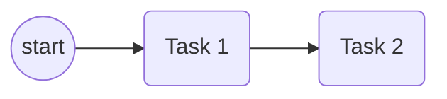

### 1.5 Node Definitions Without Edges
**Description:** Nodes defined but not connected by edges.

**Edge Cases:**
- Standalone node: `node1:task:(Task 1)`
- Multiple standalone nodes
- Nodes defined but never referenced in edges

**Expected Behavior:**
- Should create node in graph
- Node won't be part of any trace (no incoming/outgoing edges)
- Isolated nodes should be ignored in trace calculation

**Test Case:**
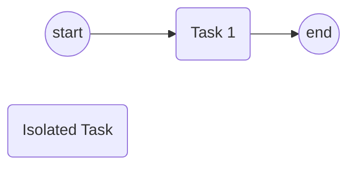

---

## Graph Structure Edge Cases

### 2.1 No Start Nodes
**Description:** Graph with no startevent nodes.

**Edge Cases:**
- Only task nodes
- Only gateways
- Only endevent nodes
- Empty graph

**Expected Behavior:**
- Should return empty array `[]`
- Log warning: "No start nodes found"
- Cannot calculate traces without start point

**Test Case:**
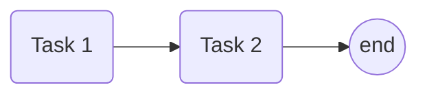

### 2.2 No End Nodes
**Description:** Graph with no endevent nodes.

**Edge Cases:**
- Only start and task nodes
- Only start and gateway nodes
- Graph with cycles but no end

**Expected Behavior:**
- Should return empty array `[]`
- Log warning: "No end nodes found"
- Cannot calculate traces without end point

**Test Case:**


### 2.3 Multiple Start Nodes
**Description:** Graph with multiple startevent nodes.

**Edge Cases:**
- Two start nodes
- Three or more start nodes
- Start nodes with different paths to same end
- Start nodes with paths to different ends

**Expected Behavior:**
- Should calculate traces from each start node
- Cartesian product: all starts × all ends
- Each start-end pair generates separate traces

**Test Case:**
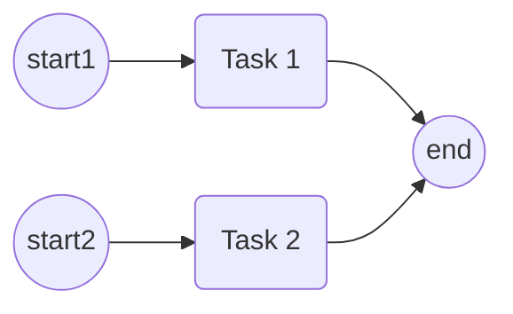

### 2.4 Multiple End Nodes
**Description:** Graph with multiple endevent nodes.

**Edge Cases:**
- Two end nodes
- Three or more end nodes
- Different paths leading to different ends
- Same path leading to multiple ends

**Expected Behavior:**
- Should calculate traces to each end node
- Cartesian product: all starts × all ends
- Each start-end pair generates separate traces

**Test Case:**
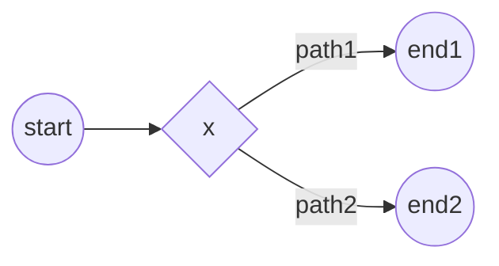

### 2.5 Disconnected Components
**Description:** Graph with multiple disconnected subgraphs.

**Edge Cases:**
- Two separate workflows
- Isolated nodes
- Some components with start/end, some without

**Expected Behavior:**
- Should only calculate traces for connected components
- Components without start/end should be ignored
- Each component processed independently

**Test Case:**
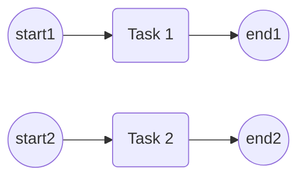

### 2.6 Dead Ends
**Description:** Nodes with no outgoing edges (except end nodes).

**Edge Cases:**
- Task node with no outgoing edges
- Gateway node with no outgoing edges
- Path leading to dead end (not end node)

**Expected Behavior:**
- Should return empty trace array `[]` for dead end paths
- Dead ends should not generate traces
- Only paths reaching end nodes should be included

**Test Case:**
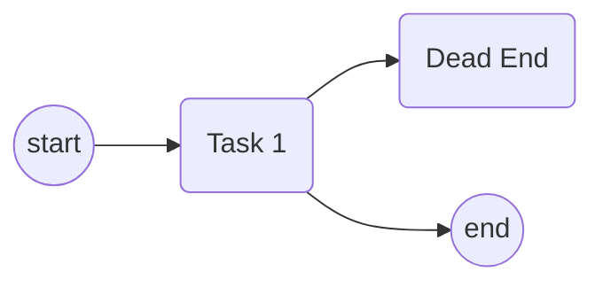

---

## Node Type Edge Cases

### 3.1 Unknown Node Types
**Description:** Nodes with unrecognized types.

**Edge Cases:**
- `node1:unknowntype:(Label)`
- Invalid type syntax: `node1:invalid:type`
- Missing type: `node1::(Label)`

**Expected Behavior:**
- Should parse node with type "unknown"
- Treated as pass-through in traversal
- Should continue processing children normally

**Test Case:**
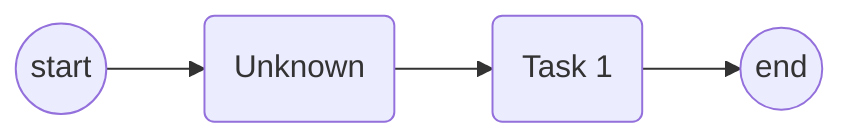

### 3.2 Task Nodes
**Description:** Task node extraction and handling.

**Edge Cases:**
- Task with label: `1:task:(Task Name)`
- Task without label: `1:task:(())`
- Task with empty label: `1:task:()`
- Task with special characters in label

**Expected Behavior:**
- Should extract: `{id: null, alt_id: "1", task: "Task Name"}`
- Empty label should result in empty string or node ID
- Label should be cleaned (parentheses removed)

**Test Case:**
```mermaid
graph LR
0:startevent:((start)) --> 1:task:(Task with "quotes" and (parens))
1:task:(Task with "quotes" and (parens)) --> 2:endevent:((end))
```

### 3.3 Start/End Event Nodes
**Description:** Start and end event nodes.

**Edge Cases:**
- `0:startevent:((start))`
- `0:startevent:(start)` (single parentheses)
- `0:startevent:((Start Event))` (with spaces)
- `0:endevent:(((end)))` (triple parentheses)

**Expected Behavior:**
- Should be treated as pass-through nodes
- Not included in trace (only tasks are)
- Should continue traversal to next nodes

**Test Case:**
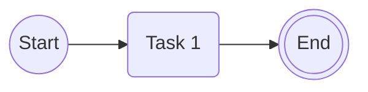

### 3.4 Gateway Node Types
**Description:** Different gateway node types and syntax.

**Edge Cases:**
- Exclusive: `gw1:exclusivegateway:{x}`
- Parallel: `gw1:parallelgateway:{AND}`
- Inclusive: `gw1:inclusivegateway:{O}` (if supported)
- Unknown gateway type

**Expected Behavior:**
- Exclusive gateway: union of alternatives
- Parallel gateway: interleave branches
- Unknown gateway: treated as pass-through

**Test Case:**
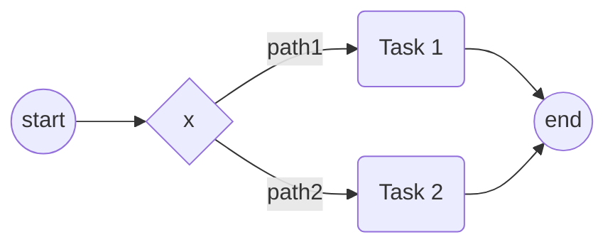

### 3.5 Node ID Collisions
**Description:** Multiple nodes with same short ID but different full IDs.

**Edge Cases:**
- `1:task:(Task 1)` and `1:task:(Task 2)` (same ID, different labels)
- `1:task:(Task)` and `1:exclusivegateway:{x}` (same ID, different types)
- Same ID in different contexts

**Expected Behavior:**
- Should use short ID as primary identifier
- First node definition wins
- Later nodes with same ID should update fullId if different
- May cause issues if nodes are truly different

**Test Case:**
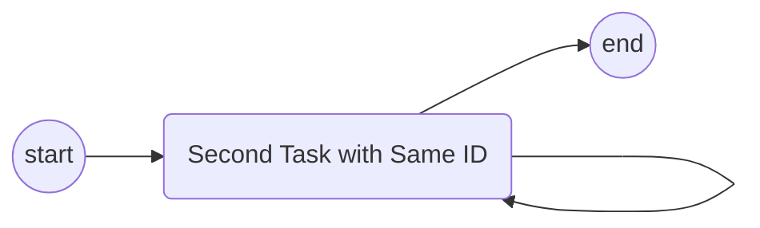

---

## Loop and Cycle Edge Cases

### 3.1 Simple Loop
**Description:** Basic cycle in graph (node back to itself or earlier node).

**Edge Cases:**
- Direct self-loop: `1:task:(Task) --> 1:task:(Task)`
- Loop through gateway: `1:task:(Task) --> 2:gateway:{x} --> 1:task:(Task)`
- Loop with multiple nodes: `1 --> 2 --> 3 --> 1`

**Expected Behavior:**
- Should detect cycle using visit counts
- Limit visits: `(maxLoopIterations + 1) * loopCount`
- Generate traces with 0, 1, 2+ iterations (bounded by limit)

**Test Case:**
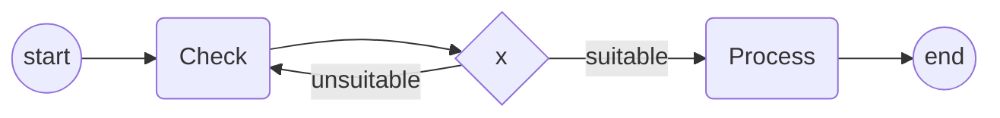

### 3.2 Nested Loops
**Description:** Loops within loops (cycles that overlap).

**Edge Cases:**
- Outer loop contains inner loop
- Overlapping cycles (share some nodes)
- Independent cycles (no shared nodes)

**Expected Behavior:**
- Should identify nodes in multiple loops
- Increase visit limit for nodes in multiple loops
- `visitLimit = (maxLoopIterations + 1) * loopCount`

**Test Case:**
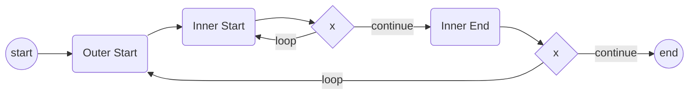

### 3.3 Multiple Independent Loops
**Description:** Multiple separate cycles in same graph.

**Edge Cases:**
- Two independent loops
- Three or more independent loops
- Loops on different paths to end

**Expected Behavior:**
- Each loop should be handled independently
- `identifyNodesInMultipleLoops()` should count cycles per node
- Nodes in multiple loops get higher visit limits

**Test Case:**
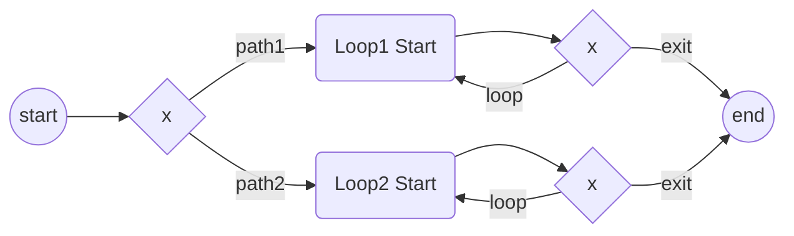

### 3.4 Loop Detection Algorithm
**Description:** `findAllCycles()` and `findCyclesFromNode()` behavior.

**Edge Cases:**
- Cycles of length 2 (A → B → A)
- Cycles of length 3+ (A → B → C → A)
- Self-loops (A → A)
- Overlapping cycles with shared nodes

**Expected Behavior:**
- Should find all cycles using DFS
- Normalize cycles (sorted node IDs) to avoid duplicates
- Return cycles as Sets of node IDs
- Only cycles with size > 1

**Test Case:**
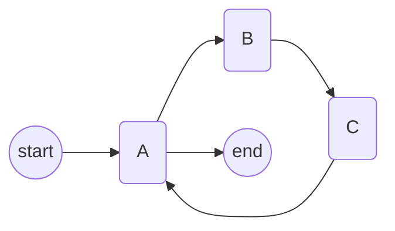

### 3.5 Loop Visit Limit Calculation
**Description:** Visit count limits for nodes in loops.

**Edge Cases:**
- Node in 1 loop: `visitLimit = (maxLoopIterations + 1) * 1`
- Node in 2 loops: `visitLimit = (maxLoopIterations + 1) * 2`
- Node in 3+ loops: proportional increase
- `maxLoopIterations = 0, 1, 2`

**Expected Behavior:**
- Default `maxLoopIterations = 1`
- Node in 1 loop: limit = 2 visits
- Node in 2 loops: limit = 4 visits
- Should prevent infinite loops

**Test Case:**
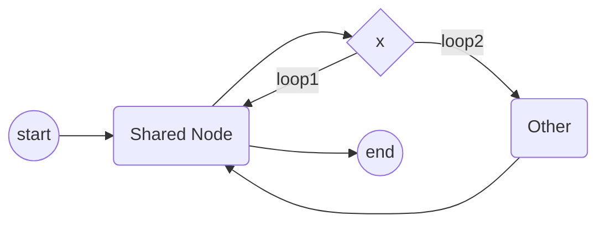

---

## Parallel Gateway Edge Cases

### 4.1 Parallel Split Without Join
**Description:** Parallel gateway with branches that don't converge.

**Edge Cases:**
- Branches lead to different end nodes
- Branches lead to same end node but no explicit join gateway
- Some branches dead-end

**Expected Behavior:**
- `findJoinGateway()` should return `null`
- Should treat branches as independent paths
- Union of all branch traces (not interleaved)

**Test Case:**
```mermaid
graph LR
0:startevent:((start)) --> 1:parallelgateway:{AND}
1:parallelgateway:{AND} --> 2:task:(Branch 1)
1:parallelgateway:{AND} --> 3:task:(Branch 2)
2:task:(Branch 1) --> 4:endevent:((end1))
3:task:(Branch 2) --> 5:endevent:((end2))
```

### 4.2 Parallel Split with Join
**Description:** Parallel gateway with matching join gateway.

**Edge Cases:**
- Two branches joining at parallel gateway
- Three or more branches joining
- Branches of different lengths
- Branches with loops

**Expected Behavior:**
- Should find join gateway using `findJoinGateway()`
- Interleave branches (all permutations)
- Continue from join to end

**Test Case:**
```mermaid
graph LR
0:startevent:((start)) --> 1:parallelgateway:{AND}
1:parallelgateway:{AND} --> 2:task:(Task A)
1:parallelgateway:{AND} --> 3:task:(Task B)
2:task:(Task A) --> 4:parallelgateway:{AND}
3:task:(Task B) --> 4:parallelgateway:{AND}
4:parallelgateway:{AND} --> 5:endevent:((end))
```

### 4.3 Multiple Parallel Sections
**Description:** Multiple parallel split-join pairs in sequence.

**Edge Cases:**
- Two parallel sections in sequence
- Nested parallel sections
- Parallel sections with different branch counts

**Expected Behavior:**
- Each parallel section should be handled independently
- Interleaving at each level
- Result: Cartesian product of all parallel permutations

**Test Case:**
```mermaid
graph LR
0:startevent:((start)) --> 1:parallelgateway:{AND}
1:parallelgateway:{AND} --> 2:task:(A1)
1:parallelgateway:{AND} --> 3:task:(B1)
2:task:(A1) --> 4:parallelgateway:{AND}
3:task:(B1) --> 4:parallelgateway:{AND}
4:parallelgateway:{AND} --> 5:task:(A2)
4:parallelgateway:{AND} --> 6:task:(B2)
5:task:(A2) --> 7:parallelgateway:{AND}
6:task:(B2) --> 7:parallelgateway:{AND}
7:parallelgateway:{AND} --> 8:endevent:((end))
```

### 4.4 Parallel with Unequal Branch Lengths
**Description:** Parallel branches with different numbers of tasks.

**Edge Cases:**
- Branch 1: 1 task, Branch 2: 3 tasks
- Branch 1: empty, Branch 2: multiple tasks
- Very long branches (10+ tasks)

**Expected Behavior:**
- Should interleave correctly regardless of length
- Each branch treated as unit (tasks stay together)
- Permutations: all orders of branch units

**Test Case:**
```mermaid
graph LR
0:startevent:((start)) --> 1:parallelgateway:{AND}
1:parallelgateway:{AND} --> 2:task:(Short)
1:parallelgateway:{AND} --> 3:task:(Long 1)
3:task:(Long 1) --> 4:task:(Long 2)
4:task:(Long 2) --> 5:task:(Long 3)
2:task:(Short) --> 6:parallelgateway:{AND}
5:task:(Long 3) --> 6:parallelgateway:{AND}
6:parallelgateway:{AND} --> 7:endevent:((end))
```

### 4.5 Parallel with Loops in Branches
**Description:** Loops inside parallel branches.

**Edge Cases:**
- Each branch has a loop
- Some branches have loops, others don't
- Loops with different iteration counts

**Expected Behavior:**
- Each branch's loop generates iterations independently
- Interleaving combines all branch traces
- Result: permutations × loop iterations from each branch

**Test Case:**
```mermaid
graph LR
0:startevent:((start)) --> 1:parallelgateway:{AND}
1:parallelgateway:{AND} --> 2:task:(Loop Start)
2:task:(Loop Start) --> 3:exclusivegateway:{x}
3:exclusivegateway:{x} --> |loop| 2:task:(Loop Start)
3:exclusivegateway:{x} --> |exit| 4:parallelgateway:{AND}
1:parallelgateway:{AND} --> 5:task:(No Loop)
5:task:(No Loop) --> 4:parallelgateway:{AND}
4:parallelgateway:{AND} --> 6:endevent:((end))
```

### 4.6 Parallel Join Gateway Detection
**Description:** Finding the correct join gateway for parallel split.

**Edge Cases:**
- Multiple parallel gateways (which is the join?)
- Join gateway not directly reachable from all branches
- Join gateway before all branches complete

**Expected Behavior:**
- `findJoinGateway()` checks if all branches can reach gateway
- Uses `pathExists()` to verify reachability
- Returns first gateway that all branches reach

**Test Case:**
```mermaid
graph LR
0:startevent:((start)) --> 1:parallelgateway:{AND}
1:parallelgateway:{AND} --> 2:task:(Branch 1)
1:parallelgateway:{AND} --> 3:task:(Branch 2)
2:task:(Branch 1) --> 4:parallelgateway:{AND}
3:task:(Branch 2) --> 5:task:(Extra Task)
5:task:(Extra Task) --> 4:parallelgateway:{AND}
4:parallelgateway:{AND} --> 6:endevent:((end))
```

---

## Exclusive Gateway Edge Cases

### 4.1 Single Outgoing Edge
**Description:** Exclusive gateway with only one outgoing edge.

**Edge Cases:**
- `gw1:exclusivegateway:{x} --> task1`
- Effectively a pass-through
- Should not create alternatives

**Expected Behavior:**
- Should be treated as sequential (no branching)
- Continue to next node normally
- Equivalent to task node with single outgoing edge

**Test Case:**
```mermaid
graph LR
0:startevent:((start)) --> 1:exclusivegateway:{x}
1:exclusivegateway:{x} --> 2:task:(Task 1)
2:task:(Task 1) --> 3:endevent:((end))
```

### 4.2 Two Alternatives
**Description:** Exclusive gateway with two outgoing edges.

**Edge Cases:**
- Two edges with labels
- Two edges without labels
- One edge with label, one without

**Expected Behavior:**
- Should generate union of both alternatives
- All traces from path 1 + all traces from path 2
- No interleaving (XOR is exclusive)

**Test Case:**
```mermaid
graph LR
0:startevent:((start)) --> 1:exclusivegateway:{x}
1:exclusivegateway:{x} --> |path1| 2:task:(Task 1)
1:exclusivegateway:{x} --> |path2| 3:task:(Task 2)
2:task:(Task 1) --> 4:endevent:((end))
3:task:(Task 2) --> 4:endevent:((end))
```

### 4.3 Three or More Alternatives
**Description:** Exclusive gateway with 3+ outgoing edges.

**Edge Cases:**
- Three alternatives
- Many alternatives (10+)
- Alternatives with different path lengths

**Expected Behavior:**
- Should generate union of all alternatives
- All traces flattened into single array
- No interleaving

**Test Case:**
```mermaid
graph LR
0:startevent:((start)) --> 1:exclusivegateway:{x}
1:exclusivegateway:{x} --> |path1| 2:task:(Task 1)
1:exclusivegateway:{x} --> |path2| 3:task:(Task 2)
1:exclusivegateway:{x} --> |path3| 4:task:(Task 3)
2:task:(Task 1) --> 5:endevent:((end))
3:task:(Task 2) --> 5:endevent:((end))
4:task:(Task 3) --> 5:endevent:((end))
```

### 4.4 Nested Exclusive Gateways
**Description:** Exclusive gateway inside alternative path.

**Edge Cases:**
- XOR in XOR (2 levels)
- XOR in XOR in XOR (3 levels)
- Mixed with parallel gateways

**Expected Behavior:**
- Each level generates its own alternatives
- Result: Cartesian product of alternatives at each level
- Example: 2 alternatives × 2 alternatives = 4 total traces

**Test Case:**
```mermaid
graph LR
0:startevent:((start)) --> 1:exclusivegateway:{x}
1:exclusivegateway:{x} --> |path1| 2:exclusivegateway:{x}
2:exclusivegateway:{x} --> |path1a| 3:task:(Task 1)
2:exclusivegateway:{x} --> |path1b| 4:task:(Task 2)
1:exclusivegateway:{x} --> |path2| 5:task:(Task 3)
3:task:(Task 1) --> 6:endevent:((end))
4:task:(Task 2) --> 6:endevent:((end))
5:task:(Task 3) --> 6:endevent:((end))
```

### 4.5 Exclusive Gateway with Loops
**Description:** Loops in exclusive gateway alternatives.

**Edge Cases:**
- Loop in one alternative
- Loops in multiple alternatives
- Different loop structures in alternatives

**Expected Behavior:**
- Each alternative's loop generates iterations
- Union combines all alternative traces
- Result: all loop iterations from all alternatives

**Test Case:**
```mermaid
graph LR
0:startevent:((start)) --> 1:exclusivegateway:{x}
1:exclusivegateway:{x} --> |path1| 2:task:(Loop Start)
2:task:(Loop Start) --> 3:exclusivegateway:{x}
3:exclusivegateway:{x} --> |loop| 2:task:(Loop Start)
3:exclusivegateway:{x} --> |exit| 4:endevent:((end))
1:exclusivegateway:{x} --> |path2| 5:task:(No Loop)
5:task:(No Loop) --> 4:endevent:((end))
```

---

## Path Finding Edge Cases

### 5.1 Path Existence Check
**Description:** `pathExists()` function behavior.

**Edge Cases:**
- Direct edge: A → B (path exists)
- Multi-hop path: A → B → C (path exists)
- No path: A and B in disconnected components
- Cycle in path: A → B → A → C (path exists, but cycles)

**Expected Behavior:**
- Should use DFS with cycle detection
- `maxDepth = 50` to prevent infinite loops
- `visited` set prevents revisiting nodes
- Returns `true` if path exists, `false` otherwise

**Test Case:**
```mermaid
graph LR
0:startevent:((start)) --> 1:task:(A)
1:task:(A) --> 2:task:(B)
2:task:(B) --> 3:task:(C)
3:task:(C) --> 4:endevent:((end))
```

### 5.2 Maximum Depth Limit
**Description:** Path finding with depth limit.

**Edge Cases:**
- Very long paths (50+ nodes)
- Paths with cycles (may exceed depth limit)
- Deeply nested structures

**Expected Behavior:**
- Should limit search to `maxDepth = 50`
- Paths longer than 50 may not be found
- Should prevent infinite loops in cycle detection

**Test Case:**
```mermaid
graph LR
0:startevent:((start)) --> 1:task:(Node 1)
1:task:(Node 1) --> 2:task:(Node 2)
# ... 50+ nodes ...
49:task:(Node 49) --> 50:endevent:((end))
```

### 5.3 Multiple Paths to Same Node
**Description:** Multiple different paths leading to same node.

**Edge Cases:**
- Two paths: A → B → C and A → D → C
- Three or more paths to same node
- Paths of different lengths

**Expected Behavior:**
- `pathExists()` should return `true` if any path exists
- Doesn't matter which path or how many
- Used for join gateway detection

**Test Case:**
```mermaid
graph LR
0:startevent:((start)) --> 1:parallelgateway:{AND}
1:parallelgateway:{AND} --> 2:task:(Path 1)
1:parallelgateway:{AND} --> 3:task:(Path 2)
2:task:(Path 1) --> 4:task:(Common)
3:task:(Path 2) --> 4:task:(Common)
4:task:(Common) --> 5:endevent:((end))
```

---

## Visit Count and Loop Detection Edge Cases

### 6.1 Visit Count Initialization
**Description:** Initial visit counts for nodes.

**Edge Cases:**
- First visit to node: count = 0
- Node not in visitCounts map
- Node visited multiple times in different paths

**Expected Behavior:**
- Should initialize with `visitCounts.get(currentNodeId) || 0`
- Increment before processing: `newVisitCounts.set(currentNodeId, currentVisitCount + 1)`
- Each recursive call gets new map copy

**Test Case:**
```mermaid
graph LR
0:startevent:((start)) --> 1:task:(Shared)
1:task:(Shared) --> 2:exclusivegateway:{x}
2:exclusivegateway:{x} --> |path1| 3:task:(Task 1)
2:exclusivegateway:{x} --> |path2| 1:task:(Shared)
3:task:(Task 1) --> 4:endevent:((end))
```

### 6.2 Visit Limit Calculation
**Description:** Calculating visit limits for nodes.

**Edge Cases:**
- Node not in any loop: `loopCount = 1`, `visitLimit = maxLoopIterations + 1`
- Node in 1 loop: `loopCount = 1`, `visitLimit = (1 + 1) * 1 = 2`
- Node in 2 loops: `loopCount = 2`, `visitLimit = (1 + 1) * 2 = 4`
- `maxLoopIterations = 0`: `visitLimit = 1 * loopCount`

**Expected Behavior:**
- `visitLimit = (maxLoopIterations + 1) * loopCount`
- Default `maxLoopIterations = 1`
- Should prevent infinite loops

**Test Case:**
```mermaid
graph LR
0:startevent:((start)) --> 1:task:(In 2 Loops)
1:task:(In 2 Loops) --> 2:exclusivegateway:{x}
2:exclusivegateway:{x} --> |loop1| 1:task:(In 2 Loops)
2:exclusivegateway:{x} --> |loop2| 3:task:(Other)
3:task:(Other) --> 1:task:(In 2 Loops)
1:task:(In 2 Loops) --> 4:endevent:((end))
```

### 6.3 Visit Limit Exceeded
**Description:** When visit count reaches or exceeds limit.

**Edge Cases:**
- Visit count equals limit: `currentVisitCount >= visitLimit`
- Visit count exceeds limit (shouldn't happen, but handle)
- Different limits for different nodes

**Expected Behavior:**
- Should return empty array `[]` when limit reached
- Stop exploring that path
- Other paths may still be valid

**Test Case:**
```mermaid
graph LR
0:startevent:((start)) --> 1:task:(Loop)
1:task:(Loop) --> 2:exclusivegateway:{x}
2:exclusivegateway:{x} --> |loop| 1:task:(Loop)
2:exclusivegateway:{x} --> |exit| 3:endevent:((end))
```

### 6.4 Fresh Visit Counts for Parallel Branches
**Description:** Visit counts for parallel branch traversal.

**Edge Cases:**
- Each branch should use fresh visit count map
- Branches may visit same nodes independently
- Join gateway should use original visit counts

**Expected Behavior:**
- Parallel branches: `new Map(visitCounts)` (fresh copy)
- Join gateway: `new Map(visitCounts)` (original counts)
- Allows independent exploration of branches

**Test Case:**
```mermaid
graph LR
0:startevent:((start)) --> 1:parallelgateway:{AND}
1:parallelgateway:{AND} --> 2:task:(Branch 1 with Loop)
2:task:(Branch 1 with Loop) --> 3:exclusivegateway:{x}
3:exclusivegateway:{x} --> |loop| 2:task:(Branch 1 with Loop)
3:exclusivegateway:{x} --> |exit| 4:parallelgateway:{AND}
1:parallelgateway:{AND} --> 5:task:(Branch 2)
5:task:(Branch 2) --> 4:parallelgateway:{AND}
4:parallelgateway:{AND} --> 6:endevent:((end))
```

---

## Node Identification Edge Cases

### 7.1 Node ID Parsing
**Description:** Parsing node identifiers from Mermaid syntax.

**Edge Cases:**
- Full format: `1:task:(Task Name)` → short ID: `1`
- With spaces: ` 1 : task : ( Task Name ) `
- Missing parts: `1::(Task)` or `1:task:`
- Special characters in ID: `node-1:task:(Task)`

**Expected Behavior:**
- Should extract short ID: `1`
- Should extract type: `task`
- Should extract label: `Task Name`
- Handle whitespace and special characters

**Test Case:**
```mermaid
graph LR
 1 : task : ( Task with Spaces )
```

### 7.2 Node Label Extraction
**Description:** Extracting and cleaning node labels.

**Edge Cases:**
- Single parentheses: `1:task:(Label)`
- Double parentheses: `1:task:((Label))`
- Triple parentheses: `1:task:(((Label)))`
- Curly braces: `1:gateway:{Label}`
- No parentheses: `1:task:Label`
- Nested parentheses: `1:task:((Outer (Inner)))`

**Expected Behavior:**
- Should remove outer parentheses/braces
- Handle nested parentheses (remove outer layer)
- Preserve inner content
- Trim whitespace

**Test Case:**
```mermaid
graph LR
0:startevent:((Start Event))
1:task:((Task with (nested) parens))
2:exclusivegateway:{XOR Gateway}
```

### 7.3 Full ID vs Short ID
**Description:** Managing full ID and short ID for nodes.

**Edge Cases:**
- Same short ID, different full IDs
- Same full ID referenced multiple times
- Updating fullId for existing node

**Expected Behavior:**
- Store both `id` (short) and `fullId` (complete)
- If node exists with same short ID, update fullId if different
- Use short ID for graph operations
- Use fullId for reference matching

**Test Case:**
```mermaid
graph LR
1:task:(Task 1) --> 1:task:(Task 1 Updated)
```

### 7.4 Node Type Normalization
**Description:** Normalizing and handling node types.

**Edge Cases:**
- Case variations: `task`, `Task`, `TASK`
- Whitespace: ` task `, `task\n`
- Unknown types: `unknowntype`, `invalid`
- Missing type: `1::(Label)`

**Expected Behavior:**
- Should normalize to lowercase
- Trim whitespace
- Default to "unknown" if missing
- Map known types: `task`, `startevent`, `endevent`, `exclusivegateway`, `parallelgateway`

**Test Case:**
```mermaid
graph LR
1:TASK:(Task 1)
2:UNKNOWNTYPE:(Unknown)
3::(Missing Type)
```

---

## Edge Label Parsing Edge Cases

### 8.1 Edge Labels
**Description:** Parsing edge labels from Mermaid syntax.

**Edge Cases:**
- With label: `node1 -->|Label| node2`
- Without label: `node1 --> node2`
- Empty label: `node1 -->|| node2`
- Label with special characters: `node1 -->|"Label"| node2`
- Multi-word labels: `node1 -->|Multi Word Label| node2`

**Expected Behavior:**
- Should extract label: `Label`
- Should trim whitespace
- Store in edge object: `{from, to, label}`
- `null` if no label

**Test Case:**
```mermaid
graph LR
0:startevent:((start)) -->|Path 1| 1:task:(Task 1)
0:startevent:((start)) -->|"Path 2"| 2:task:(Task 2)
1:task:(Task 1) --> 3:endevent:((end))
2:task:(Task 2) --> 3:endevent:((end))
```

### 8.2 Edge Label Usage
**Description:** How edge labels are used in trace calculation.

**Edge Cases:**
- Labels stored but not used in trace calculation
- Labels may be used for filtering/selection (future feature)
- Labels in exclusive gateway alternatives

**Expected Behavior:**
- Labels are currently informational only
- Not included in trace output
- May be used for conditional path selection in future

**Test Case:**
```mermaid
graph LR
0:startevent:((start)) --> 1:exclusivegateway:{x}
1:exclusivegateway:{x} --> |"Condition A"| 2:task:(Task A)
1:exclusivegateway:{x} --> |"Condition B"| 3:task:(Task B)
2:task:(Task A) --> 4:endevent:((end))
3:task:(Task B) --> 4:endevent:((end))
```

---

## Trace Combination Edge Cases

### 9.1 Empty Trace Sets
**Description:** Combining trace sets where some are empty.

**Edge Cases:**
- Empty set in `combineSequential`
- Empty set in `interleave`
- Empty set in `union`
- All sets empty

**Expected Behavior:**
- `combineSequential([])` → `[[]]` (single empty trace)
- `interleave([])` → `[[]]` (single empty trace)
- `union([])` → `[]` (empty array)
- Empty traces filtered in final result

**Test Case:**
```mermaid
graph LR
0:startevent:((start)) --> 1:exclusivegateway:{x}
1:exclusivegateway:{x} --> |path1| 2:task:(Task 1)
1:exclusivegateway:{x} --> |path2| 3:endevent:((end))
2:task:(Task 1) --> 3:endevent:((end))
```

### 9.2 Single Trace in Set
**Description:** Trace sets containing only one trace.

**Edge Cases:**
- Single trace in sequential combination
- Single trace in parallel interleaving
- Single trace in union

**Expected Behavior:**
- Should handle correctly (no special case needed)
- Result should be the single trace (or combined appropriately)

**Test Case:**
```mermaid
graph LR
0:startevent:((start)) --> 1:task:(Task 1)
1:task:(Task 1) --> 2:endevent:((end))
```

### 9.3 Large Trace Sets
**Description:** Trace sets with many traces (performance edge case).

**Edge Cases:**
- 100+ traces from parallel branches
- 1000+ traces from nested structures
- Exponential growth scenarios
- Memory limitations

**Expected Behavior:**
- Should calculate correctly (may be slow)
- Memory considerations for large result sets
- Consider optimization for production use
- May need to limit trace generation

**Test Case:**
```mermaid
graph LR
0:startevent:((start)) --> 1:parallelgateway:{AND}
1:parallelgateway:{AND} --> 2:task:(A1)
1:parallelgateway:{AND} --> 3:task:(A2)
1:parallelgateway:{AND} --> 4:task:(A3)
1:parallelgateway:{AND} --> 5:task:(A4)
1:parallelgateway:{AND} --> 6:task:(A5)
# ... 10 branches = 10! = 3,628,800 permutations
```

### 9.4 Task Node with Multiple Outgoing Edges
**Description:** Task node treated as alternatives if multiple outgoing edges.

**Edge Cases:**
- Task with 2 outgoing edges (treated as XOR)
- Task with 3+ outgoing edges
- Task with single outgoing edge (sequential)

**Expected Behavior:**
- Multiple edges: union of alternatives
- Single edge: sequential combination
- Logic: `if (outgoingEdges.length > 1)` → union, else sequential

**Test Case:**
```mermaid
graph LR
0:startevent:((start)) --> 1:task:(Task with Choices)
1:task:(Task with Choices) --> 2:task:(Path 1)
1:task:(Task with Choices) --> 3:task:(Path 2)
2:task:(Path 1) --> 4:endevent:((end))
3:task:(Path 2) --> 4:endevent:((end))
```

---

## Duplicate Trace Filtering Edge Cases

### 10.1 Identical Traces
**Description:** Multiple traces with identical task sequences.

**Edge Cases:**
- Same tasks in same order
- Generated from different paths (should be deduplicated)
- Empty traces (should be filtered)

**Expected Behavior:**
- `filterDuplicateTraces()` should remove duplicates
- Uses `JSON.stringify` for comparison
- Only unique traces returned

**Test Case:**
```mermaid
graph LR
0:startevent:((start)) --> 1:exclusivegateway:{x}
1:exclusivegateway:{x} --> |path1| 2:task:(Task 1)
1:exclusivegateway:{x} --> |path2| 2:task:(Task 1)
2:task:(Task 1) --> 3:endevent:((end))
```

### 10.2 Empty Trace Filtering
**Description:** Empty traces should be filtered out.

**Edge Cases:**
- Completely empty trace: `[]`
- Trace with only events (no tasks)
- Trace with null/undefined tasks

**Expected Behavior:**
- Empty traces should be skipped: `if (trace.length === 0) continue`
- Not included in final result
- Final array should only contain non-empty traces

**Test Case:**
```mermaid
graph LR
0:startevent:((start)) --> 1:endevent:((end))
```

### 10.3 Trace Type Determination
**Description:** Determining if trace is "loop" or "sequential".

**Edge Cases:**
- Trace with repeated node IDs (loop)
- Trace with unique node IDs (sequential)
- Trace with repeated alt_ids but different ids
- Trace with null ids (use alt_id)

**Expected Behavior:**
- Check: `nodeIds.length > uniqueNodes.size`
- Uses `id || alt_id` for comparison
- If true → "loop", else → "sequential"

**Test Case:**
```mermaid
graph LR
0:startevent:((start)) --> 1:task:(Check)
1:task:(Check) --> 2:exclusivegateway:{x}
2:exclusivegateway:{x} --> |loop| 1:task:(Check)
2:exclusivegateway:{x} --> |exit| 3:endevent:((end))
```

### 10.4 Trace Comparison
**Description:** Comparing traces for duplicate detection.

**Edge Cases:**
- Traces with same tasks but different order (not duplicates)
- Traces with same alt_ids but different tasks
- Traces with null ids vs non-null ids

**Expected Behavior:**
- Comparison uses: `{id, alt_id, task}` for each task
- Order matters (different orders = different traces)
- JSON.stringify for exact matching

**Test Case:**
```mermaid
graph LR
0:startevent:((start)) --> 1:parallelgateway:{AND}
1:parallelgateway:{AND} --> 2:task:(A)
1:parallelgateway:{AND} --> 3:task:(B)
2:task:(A) --> 4:parallelgateway:{AND}
3:task:(B) --> 4:parallelgateway:{AND}
4:parallelgateway:{AND} --> 5:endevent:((end))
# Generates: [A, B] and [B, A] - not duplicates
```

---

## Summary

This document covers all major edge cases for the Mermaid Trace Calculator. Key areas to test:

1. **Mermaid Parsing**: Invalid syntax, continuation lines, node definitions
2. **Graph Structure**: No start/end nodes, multiple starts/ends, disconnected components
3. **Node Types**: Unknown types, task extraction, gateway handling
4. **Loops**: Simple loops, nested loops, multiple loops, visit limits
5. **Parallel**: Split/join detection, unequal branches, loops in branches
6. **Exclusive**: Single/multiple alternatives, nesting, loops in alternatives
7. **Path Finding**: Existence checks, depth limits, multiple paths
8. **Visit Counts**: Initialization, limits, parallel branch handling
9. **Node ID**: Parsing, label extraction, full vs short ID
10. **Edge Labels**: Parsing, usage (informational)
11. **Combination**: Empty sets, large sets, task with multiple edges
12. **Filtering**: Duplicates, empty traces, trace types

Each edge case should be tested to ensure robust trace calculation across all Mermaid flowchart scenarios.

